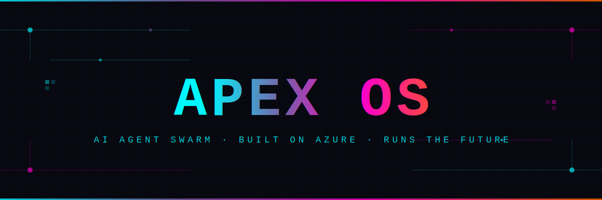

<div align="center">
  
</div>

---

<div align="center">


<br/>

```
╔══════════════════════════════════════════════════════╗
║        NICOLAE FRATILA  /  fratilanico               ║
║        Founder & CEO, APEX OS                        ║
╚══════════════════════════════════════════════════════╝
```

### `AI-first. Agent-powered. Built to dominate.`

</div>

---

## `> whoami`

```bash
$ cat about.txt
```

> Romanian founder on a mission to make autonomous AI agents the backbone of enterprise operations.
> Building **APEX OS** — an AI agent swarm deployed on Azure that handles lead-gen, outreach, and sales automation at scale.
> Replacing manual processes with intelligent, compounding pipelines for enterprise SMBs.
> If it can be automated, we're automating it. If it can't, we're figuring out how.

---

## `> ./apex-os --info`

<div align="center">

```
┌─────────────────────────────────────────────────────────────────────┐
│                         ◈  APEX OS                                  │
│         The AI Agent Swarm for Enterprise Lead Generation           │
└─────────────────────────────────────────────────────────────────────┘
```

</div>

**APEX OS** is an AI-powered SaaS platform built for enterprise SMBs that need to scale without scaling headcount. An autonomous agent swarm — orchestrated, monitored, and deployed on Microsoft Azure — handles the entire lead-gen and outreach pipeline from discovery to booked call.

| | |
|---|---|
| **What it does** | End-to-end lead generation, qualification, outreach, and follow-up automation |
| **Who it's for** | Enterprise SMBs ready to replace manual sales ops with AI agent pipelines |
| **Infrastructure** | Azure-native, Claude AI backbone, real-time agent coordination |
| **Status** | `LIVE` — Active deployments running |

<div align="center">

[](https://apex.InfoAcademy.uk)

</div>

---

## `> cat stack.json`

<div align="center">


</div>

---

## `> swarm --status --verbose`

<div align="center">

```
╔═══════════════════════════════════════════════════════════════════╗
║                    APEX OS AGENT SWARM v1.0                       ║
║                    STATUS: ██████████ ONLINE                      ║
╠═══════════════════════════════════════════════════════════════════╣
║                                                                   ║
║              ┌─────────────────────────┐                         ║
║              │  ◈  AQUILA              │                         ║
║              │     Orchestrator Agent  │                         ║
║              │     claude-opus-4-6     │                         ║
║              │     [ COMMANDING ]      │                         ║
║              └──────────┬──────────────┘                         ║
║                         │                                        ║
║          ┌──────────────┼──────────────┐                         ║
║          ▼              ▼              ▼                         ║
║   ┌──────────┐   ┌──────────┐   ┌──────────┐                    ║
║   │ WORKER 1 │   │ WORKER 2 │   │ WORKER 3 │                    ║
║   │ Sonnet   │   │ Sonnet   │   │ Sonnet   │                    ║
║   │ claude-  │   │ claude-  │   │ claude-  │                    ║
║   │ sonnet-  │   │ sonnet-  │   │ sonnet-  │                    ║
║   │ 4-6      │   │ 4-6      │   │ 4-6      │                    ║
║   │[BUILDING]│   │[BUILDING]│   │[BUILDING]│                    ║
║   └──────────┘   └──────────┘   └──────────┘                    ║
║          │              │              │                         ║
║          └──────────────┴──────────────┘                         ║
║                         │                                        ║
║              ┌──────────▼──────────────┐                         ║
║              │  ◈  REVIEWER            │                         ║
║              │     Quality Gate Agent  │                         ║
║              │     claude-opus-4-6     │                         ║
║              │     [ REVIEWING ]       │                         ║
║              └─────────────────────────┘                         ║
║                                                                   ║
║  Agents: 5/5 ACTIVE  ·  Tasks: RUNNING  ·  Uptime: 99.9%        ║
╚═══════════════════════════════════════════════════════════════════╝
```

</div>

| Agent | Model | Role | Status |
|-------|-------|------|--------|
| **Aquila** | `claude-opus-4-6` | Orchestrator — plans, delegates, coordinates |  |
| **Worker 1** | `claude-sonnet-4-6` | Dev worker — implementation & code |  |
| **Worker 2** | `claude-sonnet-4-6` | Dev worker — testing & integration |  |
| **Worker 3** | `claude-sonnet-4-6` | Dev worker — content & deployment |  |
| **Reviewer** | `claude-opus-4-6` | Quality gate — validation & approval |  |

---

## `> git stats --global`

<div align="center">

[](https://github.com/fratilanico)

[](https://github.com/fratilanico)

[](https://github.com/fratilanico)

</div>

---

## `> cat links.sh && bash links.sh`

<div align="center">

[](https://x.com/nicofratila)
[](https://www.linkedin.com/in/nicofratila)
[](https://infoacademy.uk/evolution)
[](https://apex.InfoAcademy.uk)

```
┌──────────────────────────────────────────────────────────────────────┐
│  X/Twitter  ·  @nicofratila     →  https://x.com/nicofratila         │
│  LinkedIn   ·  /in/nicofratila  →  linkedin.com/in/nicofratila       │
│  InfoAcademy                    →  infoacademy.uk/evolution           │
│  APEX OS    ·  Product          →  apex.InfoAcademy.uk               │
└──────────────────────────────────────────────────────────────────────┘
```

</div>

---

<div align="center">

```
╔══════════════════════════════════════════════════════════════╗
║                                                              ║
║         APEX OS — Built by agents. Run by Nico.             ║
║                                                              ║
║         [ fratilanico ]  ·  2026  ·  All systems go.        ║
║                                                              ║
╚══════════════════════════════════════════════════════════════╝
```

</div>
